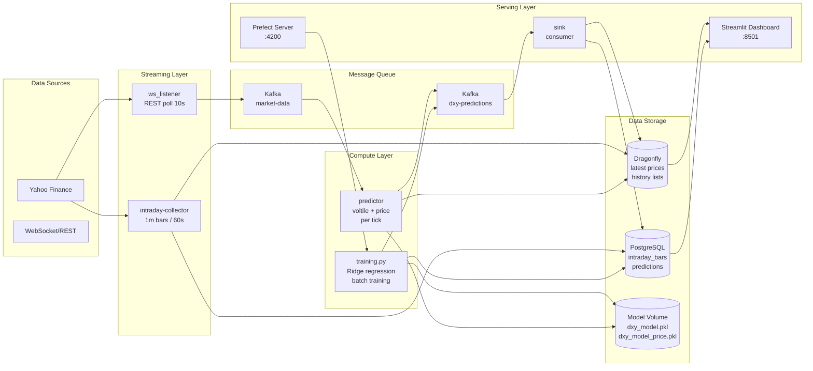

# DXY Volatility & Price Prediction Pipeline

Hybrid batch + streaming ML pipeline untuk memprediksi volatilitas dan harga DXY (US Dollar Index) secara real-time menggunakan fitur dari EUR/USD, USD/JPY, GBP/USD, VIX, dan S&P 500.

## Arsitektur



## Tech Stack

| Layer | Teknologi |
|-------|-----------|
| **Streaming** | Kafka (Confluent 7.7.0), yfinance REST/WebSocket |
| **Batch** | Prefect 3, scikit-learn Ridge |
| **Storage** | PostgreSQL 15, Dragonfly (Redis-compatible) |
| **Dashboard** | Streamlit 1.42 + Altair |
| **Container** | Docker Compose (12 services) |

## Pipeline Flow

### Streaming (Real-time)
```
ws_listener (REST 10s) → Kafka market-data → predictor (per tick inference)
    → Kafka dxy-predictions → sink → PostgreSQL + Dragonfly → Dashboard (2s refresh)
```

- Setiap tick DXY langsung diproses: fitur dihitung dari Dragonfly history → model voltile + price → kirim ke sink
- Dedup logic: skip prediction kalau perubahan voltile < 0.1% (anti-flood)
- VIX & SP500: di-forward-fill dari nilai terakhir saat market tutup

### Batch (On-demand via Prefect)
```
collector (yfinance 1m, 60s) → PostgreSQL intraday_bars
    → training.py (manual trigger) → dxy_model.pkl + dxy_model_price.pkl
```

- Baca 30 hari data 1m bars dari PostgreSQL
- Target: rolling 20-period std dev (volatilitas) + return t+1/t+3/t+5 (harga)
- Model: Ridge regression (L2 regularization), 27 fitur
- Trigger: `docker compose exec training-flow python /app/ml_pipeline/training.py`

## Cara Menjalankan

```bash
# 1. Build & start semua service
docker compose up -d --build

# 2. Training model (tunggu ~30 detik biar collector ngisi data)
docker compose exec training-flow python /app/ml_pipeline/training.py

# 3. Buka dashboard
# http://localhost:8501

# 4. Prefect UI
# http://localhost:4200

# 5. Data quality check
docker compose exec training-flow python /app/ml_pipeline/data_quality.py
```

## Environment Variables

Lihat `.env` untuk konfigurasi:

| Variable | Default | Deskripsi |
|----------|---------|-----------|
| `POSTGRES_USER` | gold | PostgreSQL user |
| `POSTGRES_PASSWORD` | gold | PostgreSQL password |
| `POSTGRES_DB` | golddb | PostgreSQL database |
| `KAFKA_BOOTSTRAP_SERVERS` | kafka:9092 | Kafka broker |
| `DRAGONFLY_HOST` | dragonfly | Dragonfly cache host |

> Password disimpan di `.env` (tidak di-commit ke git via `.gitignore`).

## Metadata Database

| Table | Owner | Deskripsi |
|-------|-------|-----------|
| `market_data` | pipeline@project-akhir-ipbd | Daily OHLCV all tickers |
| `intraday_bars` | pipeline@project-akhir-ipbd | 1m OHLCV bars untuk training |
| `predictions` | pipeline@project-akhir-ipbd | Volatility + price predictions |

## Dashboard

Streamlit dashboard di `:8501`:

- **Price Cards**: real-time harga 6 ticker (DXY, EUR, JPY, GBP, VIX, SPX)
- **Volatility Metrics**: predicted vs instant volatility
- **Alert System**: threshold slider, status indicator + warning banner
- **Volatility Chart (100 latest)**: predicted vs actual volatility time series
- **DXY Price Chart**: actual price (solid) + predicted price 1m/3m/5m (dashed)
- **Market Snapshot**: JSON detail fitur terbaru

## Data Quality

Jalankan `data_quality.py` untuk cek:

```bash
docker compose exec training-flow python /app/ml_pipeline/data_quality.py
```

Cek meliputi:
- Row count per table
- Tipe data kolom sesuai ekspektasi
- NULL values di nullable columns
- Report severity: INFO/WARN/FAIL
