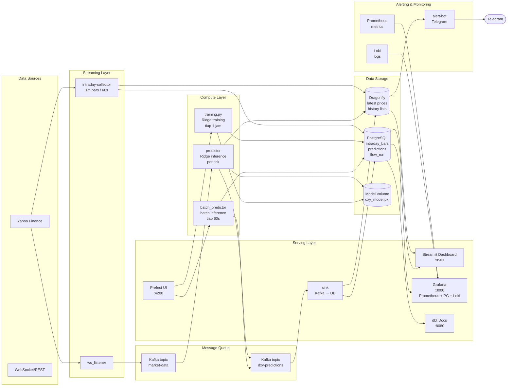

# DXY Volatility & Price Prediction Pipeline

Hybrid batch + streaming ML pipeline untuk memprediksi volatilitas dan harga DXY (US Dollar Index) secara real-time menggunakan fitur dari EUR/USD, USD/JPY, GBP/USD, VIX, dan S&P 500.

## Arsitektur



## Tech Stack

| Layer | Teknologi |
|-------|-----------|
| **Streaming** | Kafka (Confluent 7.7.0), WebSocket/REST |
| **Batch** | Prefect 3 + scikit-learn Ridge |
| **Storage** | PostgreSQL 15, Dragonfly (Redis-compatible) |
| **ML** | Ridge Regression, StandardScaler, 37 fitur (time features) |
| **Dashboard** | Streamlit 1.42 + Altair |
| **Monitoring** | Grafana + Prometheus + Loki + Promtail |
| **Orchestration** | Prefect Server + Worker |
| **Container** | Docker Compose (16 services) |

## Pipeline Flow

### Streaming (Real-time)
```
ws_listener (WebSocket + REST fallback 10s) → Kafka market-data
    → predictor (per-tick inference, Ridge model)
    → Kafka dxy-predictions → sink → Dragonfly + PostgreSQL
    → Dashboard (2s refresh) + Alert Bot (Telegram, per-tick)
```

- Setiap tick DXY langsung diproses: fitur dihitung dari Dragonfly history → model vol + price → publish ke Kafka
- Predictor force-publish tiap 2 detik (FORCE_PUBLISH_INTERVAL) untuk memastikan data real-time
- VIX & SP500 di-forward-fill dari nilai terakhir saat market tutup

### Batch (Prefect-scheduled)
```
collector (yfinance 1m bars, 60s) → PostgreSQL intraday_bars
    → Prefect dxy-training (tiap 1 jam) → dxy_model.pkl (Ridge regression)
    → Prefect dxy-batch-predict (tiap 60s) → Kafka dxy-predictions
```

- Training: Ridge alpha=0.0001, window 7 hari, 37 fitur (termasuk sin_hour, cos_hour, is_weekend)
- Target volatilitas: rolling 20-bar HL range × VOL_SCALE=5.5
- Target harga: return di t+1, t+3, t+5, t+30 menit
- Rolling windows dengan `min_periods=5` untuk cold start handling

### Prefect Deployments

| Deployment | Interval | Fungsi |
|---|---|---|
| `dxy-training` | 1 jam | Retrain model Ridge |
| `dxy-batch-predict` | 60 detik | Batch inference |
| `dbt-test` | 1 jam | Data quality tests |

## Setup Langkah demi Langkah

### Prerequisites

- Docker & Docker Compose v2
- Git
- 16GB RAM recommended (minimum 8GB)

### 1. Clone & Konfigurasi

```bash
git clone <repo-url>
cd project-akhir-ipbd
cp .env.example .env    # atau edit .env langsung
```

Edit `.env` sesuai kebutuhan:

| Variable | Wajib? | Contoh |
|---|---|---|
| `DASHBOARD_PASSWORD` | ✅ | `dxy2024` |
| `GRAFANA_PASSWORD` | ✅ | `admin` |
| `DRAGONFLY_PASSWORD` | ✅ | `dragonfly_secret` |
| `TELEGRAM_BOT_TOKEN` | Opsional | `8635631605:AAEue8z...` |
| `TELEGRAM_CHAT_ID` | Opsional | `1716002579` |

### 2. Build & Start Semua Service

```bash
docker compose up -d --build
```

Perintah ini akan membangun image dan menjalankan **16 service** secara berurutan. Tunggu ~2-3 menit sampai semua service siap.

Cek status:
```bash
docker compose ps
```

Semua service harus berstatus `Up`.

### 3. Training Model Awal

Tunggu ~30 detik sampai `intraday-collector` mengisi data 1m bars ke PostgreSQL:

```bash
docker compose exec training-flow python /app/ml_pipeline/training.py
```

Output sukses:
```
Vol model trained on XX rows, 37 features (scaled)
Price model trained on XX rows, 4 targets (t+1, t+3, t+5, t+30)
```

### 4. Akses Komponen

| Komponen | URL | Auth | Kegunaan |
|---|---|---|---|
| **Streamlit Dashboard** | http://localhost:8501 | Password (`DASHBOARD_PASSWORD`) | Visualisasi harga, volatilitas, prediksi |
| **Grafana** | http://localhost:3000 | admin / `GRAFANA_PASSWORD` | Monitoring pipeline + logs |
| **Prefect UI** | http://localhost:4200 | - | Flow runs, schedule, logs |
| **dbt Docs** | http://localhost:8080 | - | Dokumentasi data & lineage |
| **Prometheus** | http://localhost:9090 | - | Metrics & alerting |

### 5. Setup Alerting (Opsional)

Agar bot Telegram aktif:

1. Buka `@BotFather` di Telegram → `/newbot` → buat bot baru
2. Dapatkan token bot
3. Chat bot lo → kirim `/start`
4. Buka di browser: `https://api.telegram.org/bot<TOKEN>/getUpdates`
5. Cari `"chat":{"id":<ANGKA>}` → itu Chat ID
6. Masukkan token & chat ID ke `.env`:
   ```
   TELEGRAM_BOT_TOKEN=<token>
   TELEGRAM_CHAT_ID=<chat_id>
   ALERT_THRESHOLD=0.001
   ```
7. Restart alert-bot:
   ```bash
   docker compose up -d --build alert-bot
   ```

### 6. Verifikasi

Cek apakah pipeline berjalan normal:

```bash
# Cek log predictor (harus ada pred_vol tiap 2-3 detik)
docker compose logs predictor --tail 5 | grep pred_vol

# Cek log alert-bot (harus ada New tick tiap 2-3 detik)
docker compose logs alert-bot --tail 5 | grep "New tick"

# Cek dbt data quality
docker compose exec dbt dbt test

# Cek batch metrics di DB
docker compose exec postgres psql -U gold -d golddb -c "SELECT * FROM batch_metrics ORDER BY timestamp DESC LIMIT 3;"
```

## Environment Variables

Lihat `.env` untuk konfigurasi lengkap:

| Variable | Default | Deskripsi |
|----------|---------|-----------|
| `POSTGRES_USER` | gold | PostgreSQL user |
| `POSTGRES_PASSWORD` | gold | PostgreSQL password |
| `POSTGRES_DB` | golddb | PostgreSQL database |
| `KAFKA_BOOTSTRAP_SERVERS` | kafka:9092 | Kafka broker |
| `DRAGONFLY_HOST` | dragonfly | Dragonfly cache host |
| `DRAGONFLY_PASSWORD` | (empty) | Dragonfly auth password |
| `DASHBOARD_PASSWORD` | dxy2024 | Streamlit dashboard password |
| `GRAFANA_PASSWORD` | admin | Grafana admin password |
| `TELEGRAM_BOT_TOKEN` | - | Telegram bot token untuk alerting |
| `TELEGRAM_CHAT_ID` | - | Chat ID tujuan alert |
| `ALERT_THRESHOLD` | 0.001 | Threshold volatilitas untuk WARNING |

> Semua kredensial disimpan di `.env` (tidak di-commit ke git via `.gitignore`). 
> Untuk mengaktifkan autentikasi, isi password yang sesuai. Default digunakan jika tidak diisi.

## Metadata Database

### PostgreSQL Tables

| Table | Deskripsi |
|-------|-----------|
| `market_data` | Daily OHLCV all tickers |
| `intraday_bars` | 1m OHLCV bars untuk training |
| `predictions` | Volatility + price predictions (batch & stream) |
| `batch_metrics` | Batch predictor cycle results (Grafana monitoring) |
| `dbt_test_results` | dbt data quality test history |
| `flow_run` | Prefect flow run records |

### Dragonfly Keys

| Key | Deskripsi |
|-----|-----------|
| `latest:dxy:close` | Harga DXY terbaru |
| `latest:dxy:instant_volatility` | Volatilitas instan (tick-level) |
| `latest:dxy:predicted_volatility` | Prediksi volatilitas (stream) |
| `latest:dxy:batch_predicted_volatility` | Prediksi volatilitas (batch) |
| `latest:dxy:pred_price_1m/3m/5m/30m` | Prediksi harga ke depan |
| `latest:dxy:predicted_timestamp` | Timestamp prediksi terakhir |
| `history:dxy:*` | Riwayat harga (capped 200) |

## Dashboard — Streamlit (`:8501`)

Dashboard utama dilindungi password. Fitur:

- **Price Cards**: real-time harga 6 ticker (DXY, EUR, JPY, GBP, VIX, SPX)
- **Volatility Metrics**: predicted (batch) vs instant volatility
- **Alert System**: threshold slider, status indicator + warning banner
- **DXY Price Chart**: 6 line chart (Actual, Predicted, Pred 1m/3m/5m/30m) dengan brush zoom
- **Market Snapshot**: JSON detail fitur terbaru

## Monitoring — Grafana (`:3000`)

Grafana terintegrasi dengan 3 data source:

| Data Source | Isi |
|---|---|
| **Prometheus** | Batch metrics, dashboard metrics, Prefect flow metrics |
| **PostgreSQL** | `batch_metrics` (volatility), `dbt_test_results`, `flow_run` (Prefect) |
| **Loki** | Log semua container real-time |

Dashboard pre-built: **DXY Pipeline Overview** (`/d/dxy-pipeline-overview`)

### Panel tersedia:
- Batch Predicted vs Actual Volatility (time series)
- dbt Test Pass/Error History (time series)
- Flow runs status per deployment
- Log viewer per container (Loki)

## Alerting — Telegram Bot

Bot Telegram mengirim notifikasi real-time setiap ada tick baru dari pipeline.

### Format Pesan
```
📊 DXY Pipeline Update — 10:51:44 UTC
Status: NORMAL ✅
📈 DXY: 101.2750 (+0.0023)
Vol: 0.000029 (threshold 0.0010)
Pred: 1m=101.3169 | 3m=101.3379 | 5m=101.3726 | 30m=101.2761
Flow batch: ✅ | training: ❓ | dbt: ❓
```

### Fitur
- ✅ Status per-tick (NORMAL / WARNING)
- ✅ Price direction indicator (📈 up / 📉 down / ➡️ flat) + delta
- ✅ Predicted prices 1m, 3m, 5m, 30m
- ✅ Flow run status (batch, training, dbt)
- ✅ Heartbeat tiap 5 menit (bot masih hidup)

### Setup
1. Buat bot via `@BotFather` di Telegram
2. Dapatkan token dan chat ID
3. Set di `.env`: `TELEGRAM_BOT_TOKEN`, `TELEGRAM_CHAT_ID`, `ALERT_THRESHOLD`

## Data Quality — dbt

dbt docs serve di `:8080` dengan:

- **2 models**: `intraday_bars`, `predictions` (pass-through views)
- **7 data tests**: `not_null`, `unique`, `accepted_values`
- **Metadata & lineage**: auto-generated docs

Jalankan:
```bash
docker compose exec dbt dbt test
```

Hasil tersimpan di tabel `dbt_test_results` dan divisualisasikan di Grafana.

## Kegunaan Tiap Stack

| # | Service | Teknologi | Fungsi |
|---|---------|-----------|--------|
| 1 | **ws_listener** | Python + WebSocket | Streaming harga real-time 6 ticker (DXY, EUR, JPY, GBP, VIX, SPX). Fallback ke REST API tiap 10 detik. |
| 2 | **intraday-collector** | Python + yfinance | Polling 1m OHLCV bars tiap 60 detik. Data disimpan ke PostgreSQL untuk training + Dragonfly untuk real-time. |
| 3 | **predictor** | Python + scikit-learn | Inferensi model Ridge per-tick. Menghitung prediksi volatilitas (inst_vol) dan harga (1m/3m/5m/30m). Force-publish tiap 2 detik. |
| 4 | **batch_predictor** | Python + scikit-learn | Inferensi batch tiap 60 detik dari 1m bars PostgreSQL. Prediksi volatilitas struktural (rolling HL range). |
| 5 | **sink** | Python + Kafka Consumer | Membaca hasil prediksi dari Kafka, menyimpan ke PostgreSQL (historis) dan Dragonfly (real-time). |
| 6 | **training** | Python + scikit-learn | Training Ridge regression tiap 1 jam. 37 fitur (termasuk time features). Output: model `.pkl` + scaler. |
| 7 | **alert-bot** | Python + Telegram API | Notifikasi real-time per tick ke Telegram. Status NORMAL/WARNING, price direction, flow status, heartbeat. |
| 8 | **training-flow** | Python + Prefect | Orchestrator Prefect: serve 3 deployment (training, batch-predict, dbt-test). Fix deployment path via REST API. |
| 9 | **kafka / zookeeper** | Confluent Kafka 7.7.0 | Message broker. 2 topic: `market-data` (raw ticks) dan `dxy-predictions` (hasil ML). |
| 10 | **postgres** | PostgreSQL 15 | Database utama: `intraday_bars`, `predictions`, `batch_metrics`, `dbt_test_results`, + Prefect tables (`flow_run`). |
| 11 | **dragonfly** | DragonflyDB 1.27 | Redis-compatible in-memory store. Real-time prices, volatilitas, prediksi terbaru, history lists (capped 200). |
| 12 | **dashboard** | Streamlit + Altair | Visualisasi interaktif: price cards, volatility chart, DXY price chart (6 lines), alert system, market snapshot. |
| 13 | **grafana** | Grafana 13 | Monitoring dashboard multi-source: Prometheus (metrics), PostgreSQL (pipeline data), Loki (logs). |
| 14 | **prometheus** | Prometheus | Metric collection: batch cycles, errors, predicted/actual vol, dashboard refreshes. |
| 15 | **loki + promtail** | Grafana Loki | Logging terpusat. Promtail auto-discover semua container via Docker socket, kirim ke Loki. Query dari Grafana. |
| 16 | **prefect-server** | Prefect 3 | Workflow orchestration: scheduling, flow runs, task retries, API untuk deployment management. |
| 17 | **prefect-worker** | Prefect 3 Process | Execute flow runs dalam subprocess. Menjalankan training, batch predict, dan dbt test. |
| 18 | **dbt** | dbt-postgres 1.12 | Data documentation & lineage. 2 models (pass-through views), 7 data quality tests, docs serve di port 8080. |

## Keamanan Data

| Aspek | Implementasi |
|---|---|
| **Autentikasi Database** | PostgreSQL user/password via `.env`. Dragonfly `requirepass`. |
| **Autentikasi Dashboard** | Streamlit dashboard dilindungi password (`DASHBOARD_PASSWORD`). |
| **Autentikasi Grafana** | Grafana admin password dari `GRAFANA_PASSWORD`. |
| **Manajemen Secrets** | Semua kredensial di `.env`, tidak masuk git (`.gitignore`). |
| **Akses Jaringan** | Service hanya terekspos via Docker internal network, kecuali dashboard/UI. |

## Persistence

| Volume | Path | Fungsi |
|---|---|---|
| `pgdata` | `/var/lib/postgresql/data` | PostgreSQL data |
| `dfdata` | `/data` | Dragonfly snapshot |
| `model_storage` | `/app/models` | Model files (.pkl, .joblib) |
| `grafana-data` | `/var/lib/grafana` | Grafana dashboards & config |
| `prometheus-data` | `/prometheus` | Prometheus time series |
| `loki-data` | `/loki` | Loki log chunks |
